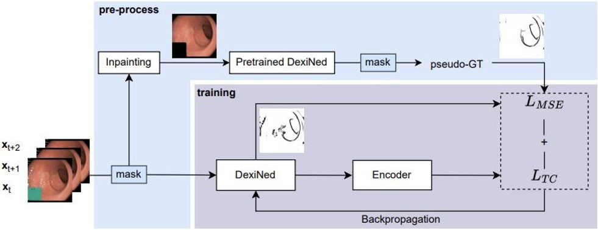
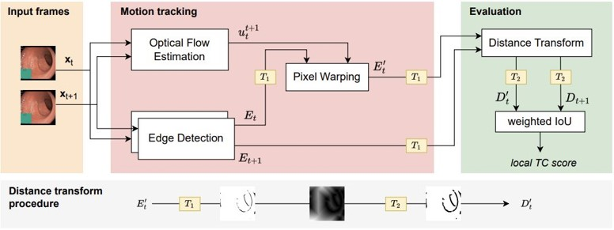

# A Self-supervised Approach for Detecting the Edges of Haustral Folds in Colonoscopy Video

This is the official Pytorch Implementation for the paper [A Self-supervised Approach for Detecting the Edges of Haustral Folds in Colonoscopy Video](https://link.springer.com/chapter/10.1007/978-3-031-44992-5_6). We proposed a self-supervised method to train an edge detection method for colonoscopy video, demonstrating that it can effectively detect anatomy related edges while ignoring light reflection artifacts abundant in colonoscopy. We also propose a metric to evaluate the temporal consistency of estimated edges in the absence of real groundtruth. The edges on Haustral folds are geometrically consistent, enabling greater reliablity for downstream tasks such as motion estimation. And we can, based on edge features, develop a more stable 3D navigation system. 

<p align="center">

</p>
<p align="center">

</p>

## Setup and Instruction

### Dependencies

This work uses Python 3.9 and Pytorch with CUDA installed. Run ```requirements.txt``` to install all related packages. To install the supported Pytorch version, please run the following,

```
conda install pytorch==1.12.1 torchvision==0.13.1 torchaudio==0.12.1 cudatoolkit=11.6 -c pytorch -c conda-forge
```

### FlowNet2 setup
FlowNet2 is an open source deep learning architecture for optical flow estimation. It is needed for evaluation (in the ```/third_party``` folder).

The original repository uses Unix file ```install.sh``` to install custom layers. But it is not friendly to Windows users. To set up all related packages in Windows, run the following commands under the folders ```~/third_party/FlowNet2/networks/channelnorm_package```, ```~/third_party/FlowNet2/networks/correlation_package``` and ```~/third_party/FlowNet2/networks/resample2d_package```. 

```
$ python setup.py build
$ python setup.py install
```

Caution: image input must be a multiple of 64.

<!---
    Note for install.sh,
      Open Sublime App, change line endings under 'view' menu to Unix
-->


### Preprocessing

This step is not required if you use our provided dataset. For users who want to test on their own colonoscopy videos, empty the test folder and put data in video format under ```dataset_origin\test\videos``` directory, run the command below to extract video frames(.jpg images) from the original videos.

```
$ python main.py --mode prep
```

<!---
Pseudo-roundtruth labels are predictions from the pre-trained DexiNed model, with input being applied with image inpainting method. Run the following command to produce pseudo-groundtruth for training and validation sets,

```
$ python main.py --mode test --result_path dataset_origin\train\gt\

$ python main.py --mode test --data_path dataset_origin\val\TC\  --result_path dataset_origin\val\gt\
``` 
-->


### Training

To train DexiNed with triplet loss, run:

```
$ python main.py --mode train --ploss [PIXEL_WISE_LOSS] --weight [WEIGHT] --checkpoint [NAME_OF_CHECKPOINT]
```

To train DexiNed with quadruplet loss, run:

```
$ python main.py --mode train --closs quadruplet --ploss [PIXEL_WISE_LOSS] --weight [WEIGHT] --checkpoint [NAME_OF_CHECKPOINT]
```

Where ```closs``` is the consistency loss, ```ploss``` is the pixel-wise loss and ```checkpoint``` is the name of checkpoint to be saved. An example of training a model with triplet loss and MSE loss with weight equal to 0.7 is given below.

```
$ python main.py --mode train --closs triplet --ploss mse --weight 0.7 --checkpoint triplet_mse_w7.pth
```


### Testing

Running the following command will produce edge-maps for the test data,

```
$ python main.py --mode test --thr1 250 --data_path dataset_origin\test\ --result_path result\test --checkpoint [NAME_OF_CHECKPOINT]
```

Replace ```[NAME_OF_CHECKPOINT]``` with the targeted model name in the folder of checkpoints. An example is ```triplet_mse_w1_best.pth``` which is the best model checkpoint used in the paper.

To evaluate prediction consistency with our evaluation metric, run the following command will produce mean and standard deviation of temporal consistency over the test videos, and the average pixel rate which measures the ratio of edge pixels to white pixels.

```
$ python main.py --mode eval --thr1 240 --checkpoint [NAME_OF_CHECKPOINT]
```


# Data

We used a subet of [HyperKvasir Gastrointestinal Dataset](https://datasets.simula.no/hyper-kvasir/), including 31 videos of lower GI with adequate bowel preparation (labelled as BBPS 2-3).

All data and checkpoints are available [online](https://drive.google.com/file/d/1AMOY6uNeFo36ZSjjNGjA-ipHFtgOkHPM/view?usp=sharing). A summary is listed below:

```


.\dataset_origin\                 dataset folder including training, validation, test set and test data using Foldit.
.\dataset_origin\train\TC         image folder including the original RGB video frames for training
.\dataset_origin\train\gt         label folder including pseudo-groundtruth labels for training
.\dataset_origin\val\TC           image folder including the original RGB video frames for validation
.\dataset_origin\val\gt           label folder including pseudo-groundtruth labels for validation
.\dataset_origin\test             image folder including the original RGB video frames for testing
.\dataset_origin\foldit\TC        image folder including the original RGB video frames for testing
.\dataset_origin\foldit\gt        image segmentation of Foldit, used for qualitative comparision

.\checkpoints                     saved models

.\annotation\labels               folder including 78 annotated labels

.\supplementary                   folder with supplementary files that include more details of the paper
```

The pseudo-groundtruth labels are predictions of the pre-trained DexiNed, with input videos applied with [temporal specularity removal](https://arxiv.org/pdf/2203.17013.pdf)(Daher et al., 2022). The annotated labels are used for edge detection evaluation (ODS, OIS & AP), for which we used [Structured Edge Detection Toolbox](https://github.com/pdollar/edges) in MATLAB. (A reminder: the toolbox uses inverted pixel intensities.)

Please copy the folders ```.\dataset_origin``` and ```.\checkpoints``` directly into the root folder of this repository.


# Acknowledgement

This work was supported by the Wellcome/EPSRC Centre for Interventional and Surgical Sciences (WEISS) at UCL (203145Z/16/Z) and the H2020 FET EndoMapper project (GA863146). This work was partially carried out during the MSc in Robotics and Computation graduate degree at the Computer Science Department, UCL.

# Citation

```
Left empty until available.
```
